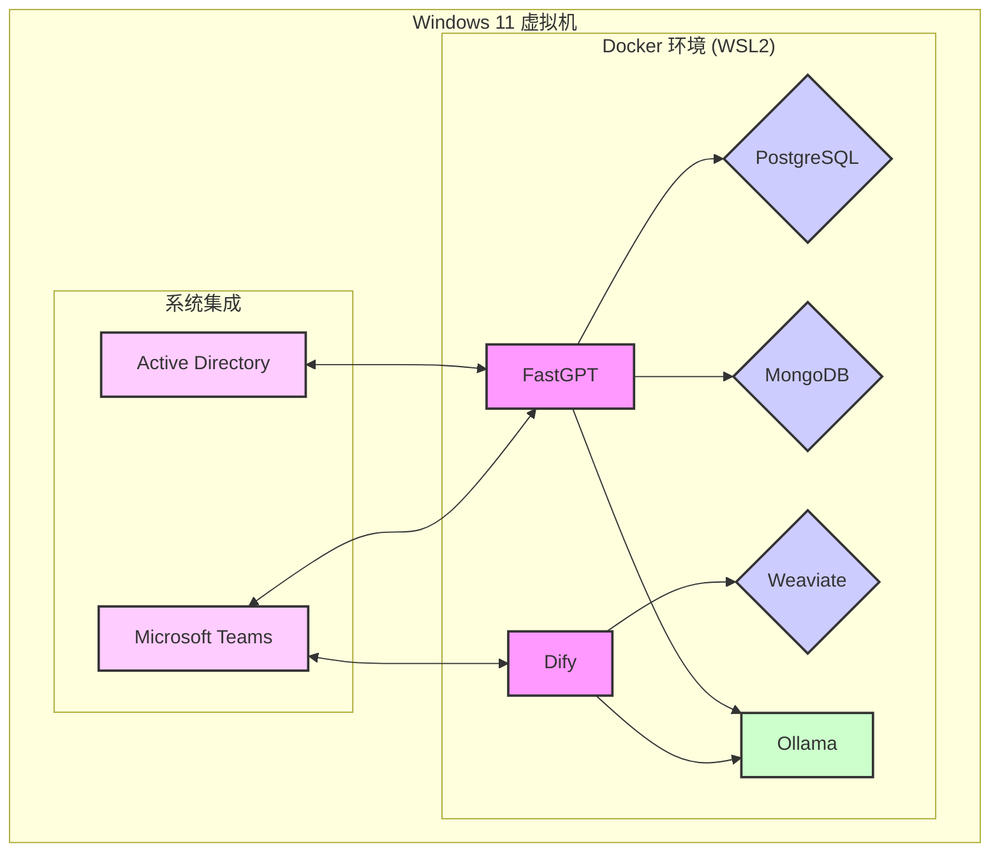

# FastGPT + Dify 私有化部署与集成技术方案

---

## 一、概述

### 1.1 项目目标
本方案旨在实现 **FastGPT** 和 **Dify** 两大 AI 智能体平台的私有化部署，并集成 **Windows 11 虚拟机 + 域账户 + Microsoft Teams**，构建一个安全、可控、可扩展的企业级 AI 开发与协作环境。

---

## 二、部署架构

### 2.1 总体架构图
```
+-----------------------------+
|           Windows 11 VM     |
|  +------------------------+ |
|  | FastGPT (Docker)        | |
|  | Dify (Docker)           | |
|  | Ollama (Local/Remote)   | |
|  +------------------------+ |
|  +------------------------+ |
|  | Active Directory 集成   | |
|  | Teams 消息通知          | |
|  +------------------------+ |
+-----------------------------+
```

### 2.2 技术选型
| 组件               | 技术选型                                                                 | 说明                                                                 |
|--------------------|--------------------------------------------------------------------------|----------------------------------------------------------------------|
| 操作系统           | Windows 11 Pro / Server 2022                                            | 支持 Docker 和 WSL2                                                  |
| 容器化部署         | Docker Desktop + WSL2                                                   | 支持 Linux 容器与 Windows 容器                                      |
| 数据库             | PostgreSQL + MongoDB (FastGPT) / Weaviate (Dify)                        | FastGPT 使用 PostgreSQL 和 MongoDB，Dify 使用 Weaviate 向量数据库     |
| 模型服务           | Ollama（本地） / Xinference（远程）                                     | 支持多种大模型（如 LLaVA、GPT-4o-mini 等）                           |
| 身份认证           | Active Directory + LDAP                                                 | 集成企业域账户，实现统一身份认证                                    |
| 消息通知           | Microsoft Teams Webhook                                                 | 任务执行状态推送至 Teams 频道                                       |
| 安全协议           | HTTPS + SSL 证书                                                        | 所有服务通过 HTTPS 访问                                              |

---

## 三、部署步骤

### 3.1 环境准备

#### 3.1.1 Windows 11 虚拟机配置
1. **安装 WSL2**
   ```powershell
   # 启用 WSL
   wsl --install
   # 设置默认版本为 WSL2
   wsl --set-default-version 2
   ```
2. **安装 Docker Desktop**
   - 下载地址：[Docker Desktop for Windows](https://www.docker.com/products/docker-desktop/)
   - 启用 WSL2 支持：在 Docker Desktop 设置中勾选 `Use the WSL2 based engine`。
3. **配置 Docker Compose**
   - 确保 `docker compose` 命令可用，验证版本：
     ```powershell
     docker compose --version
     ```

#### 3.1.2 网络与安全配置
1. **配置静态 IP**
   - 在 Hyper-V 或 VMware 中为虚拟机分配静态 IP 地址（如 `192.168.1.100`）。
2. **开放防火墙端口**
   - 开放端口：`80`（HTTP）、`443`（HTTPS）、`11434`（Ollama）、`5432`（PostgreSQL）、`27017`（MongoDB）。
3. **SSL 证书配置**
   - 使用企业内部 CA 签发证书，配置 Docker 容器的 HTTPS 服务：
     ```powershell
     # 示例：将证书导入 Docker
     docker run -d \
       -v C:\certs\server.crt:/etc/ssl/certs/server.crt \
       -p 443:443 \
       --name fastgpt-https \
       fastgpt
     ```

---

### 3.2 FastGPT 部署

#### 3.2.1 克隆仓库与配置
```powershell
# 克隆 FastGPT 仓库
git clone https://github.com/labring/FastGPT.git
cd FastGPT

# 创建并编辑 .env 文件
cp .env.example .env
notepad .env
```
**关键配置项**：
```env
# 数据库配置
POSTGRES_HOST=localhost
POSTGRES_PORT=5432
POSTGRES_USER=postgres
POSTGRES_PASSWORD=your_password

# Ollama 配置
OLLAMA_HOST=http://localhost:11434
```

#### 3.2.2 启动服务
```powershell
# 拉取镜像
docker compose pull

# 启动服务
docker compose up -d

# 验证状态
curl http://localhost/health
```

#### 3.2.3 数据库初始化
- FastGPT 会自动创建 PostgreSQL 和 MongoDB 实例，首次启动后可通过以下命令验证：
  ```powershell
  docker exec -it fastgpt_postgres_1 psql -U postgres -c "\l"
  docker exec -it fastgpt_mongo_1 mongosh
  ```

---

### 3.3 Dify 部署

#### 3.3.1 克隆仓库与配置
```powershell
# 克隆 Dify 仓库
git clone https://github.com/langgenius/dify.git
cd dify/docker

# 创建并编辑 .env 文件
cp .env.example .env
notepad .env
```
**关键配置项**：
```env
# 数据库配置
WEAVIATE_HOST=weaviate
WEAVIATE_PORT=6080

# 模型服务
OLLAMA_HOST=http://192.168.1.100:11434
```

#### 3.3.2 启动服务
```powershell
# 拉取镜像
docker compose pull

# 启动服务
docker compose up -d

# 访问安装页面
Start-Process http://localhost/install
```

#### 3.3.3 配置 Ollama 模型
1. 登录 Dify 管理界面：`http://localhost`
2. 进入 **设置 > 模型供应商 > Ollama**，填写：
   - 模型名称：`llava`
   - 基础 URL：`http://192.168.1.100:11434`
   - 模型类型：`对话`
   - 上下文长度：`4096`
   - 是否支持 Vision：`是`

---

## 四、域账户集成

### 4.1 Active Directory 配置
1. **安装 LDAP 客户端**
   - 在 Windows 虚拟机中启用 LDAP 客户端：
     ```powershell
     Enable-WindowsOptionalFeature -Online -FeatureName LDAP-Client -All
     ```
2. **配置 FastGPT 域认证**
   - 修改 FastGPT 的 `config.json` 文件：
     ```json
     {
       "ldap": {
         "enable": true,
         "url": "ldap://ad.example.com:389",
         "bindDN": "CN=Admin,OU=Users,DC=example,DC=com",
         "bindCredentials": "password",
         "searchBase": "OU=Users,DC=example,DC=com",
         "searchFilter": "(sAMAccountName={{username}})"
       }
     }
     ```
3. **重启 FastGPT 服务**
   ```powershell
   docker compose restart app
   ```

### 4.2 Dify 域认证配置
- Dify 目前不原生支持 LDAP，需通过反向代理（如 Nginx）实现 SSO：
  ```nginx
  location / {
      proxy_pass http://dify;
      auth_basic "Restricted";
      auth_basic_user_file /etc/nginx/.htpasswd;
  }
  ```

---

## 五、Teams 集成

### 5.1 创建 Incoming Webhook
1. 在 Teams 频道中创建自定义入站 Webhook：
   - 名称：`FastGPT Alerts`
   - Webhook URL 示例：`https://outlook.office.com/webhook/...`

### 5.2 配置通知脚本
- **FastGPT 通知脚本**（Python）：
  ```python
  import requests
  import json

  def send_teams_message(webhook_url, message):
      payload = {
          "text": message
      }
      response = requests.post(webhook_url, data=json.dumps(payload))
      return response.status_code

  # 示例调用
  webhook_url = "https://outlook.office.com/webhook/..."
  status = send_teams_message(webhook_url, "任务执行完成！")
  print(f"Status Code: {status}")
  ```

- **Dify 通知配置**：
  - 在 Dify 工作流中添加 `HTTP Request` 节点，配置：
    - URL：`https://outlook.office.com/webhook/...`
    - Method：`POST`
    - Body：`{"text": "{{execution_status}}"}`

---

## 六、技术栈整合

| 组件               | 技术选型                                                                 | 说明                                                                 |
|--------------------|--------------------------------------------------------------------------|----------------------------------------------------------------------|
| 操作系统           | Windows 11 Pro / Server 2022                                            | 支持 Docker 和 WSL2                                                  |
| 容器化部署         | Docker Desktop + WSL2                                                   | 支持 Linux 容器与 Windows 容器                                      |
| 数据库             | PostgreSQL + MongoDB (FastGPT) / Weaviate (Dify)                        | FastGPT 使用 PostgreSQL 和 MongoDB，Dify 使用 Weaviate 向量数据库     |
| 模型服务           | Ollama（本地） / Xinference（远程）                                     | 支持多种大模型（如 LLaVA、GPT-4o-mini 等）                           |
| 身份认证           | Active Directory + LDAP                                                 | 集成企业域账户，实现统一身份认证                                    |
| 消息通知           | Microsoft Teams Webhook                                                 | 任务执行状态推送至 Teams 频道                                       |
| 安全协议           | HTTPS + SSL 证书                                                        | 所有服务通过 HTTPS 访问                                              |

---

## 七、安全与权限控制

### 7.1 权限管理
- **最小权限原则**：FastGPT/Dify 容器仅能访问指定目录（如 `C:\data`）。
- **敏感操作限制**：禁止直接调用 `os.system`、`subprocess` 等系统命令。

### 7.2 安全验证
- **代码扫描**：使用 Bandit 检测生成的 Python 脚本。
- **容器隔离**：通过 Docker 的 `--read-only` 和 `--cap-drop` 限制容器权限。

### 7.3 审计日志
- **日志收集**：通过 ELK Stack（Elasticsearch + Logstash + Kibana）集中管理日志。
- **审计内容**：记录用户操作、工具调用、模型请求等关键事件。

---

## 八、后续优化方向

1. **自动化部署**：编写 PowerShell 脚本一键部署 FastGPT + Dify。
2. **模型管理**：集成 Hugging Face Hub 实现模型版本控制。
3. **高可用架构**：部署负载均衡（如 Nginx）和数据库主从复制。
4. **多租户支持**：为不同部门分配独立工作空间，隔离数据与权限。

---

**文档版本**：v1.0  
**最后更新**：2025-07-02


## 0. 引言

随着人工智能技术的飞速发展，企业对于构建内部AI能力的需求日益增长。FastGPT 和 Dify 作为领先的AI智能体开发平台，为企业提供了强大的工具来快速构建、部署和管理各类AI应用。本技术方案旨在详细阐述如何在企业内部环境中，特别是基于Windows 11虚拟机，实现FastGPT和Dify的私有化部署，并将其与企业现有的Active Directory域账户系统以及Microsoft Teams协作平台无缝集成。通过本方案的实施，企业将能够建立一个安全、可控、高效的AI开发与协作基础设施，赋能内部团队，加速AI创新。

本方案将从系统架构、部署步骤、域账户集成、Teams消息通知、安全考量以及未来优化方向等多个维度进行深入探讨，旨在为IT管理员和开发者提供一份全面且易于遵循的部署指南。我们深知私有化部署的复杂性，因此，本方案将尽可能提供详细的步骤和最佳实践，以确保部署过程的顺利进行，并最大化系统的稳定性和安全性。

---


### 1.1 项目目标

本项目的核心目标是为企业内部构建一个全面、安全且高效的AI智能体开发与协作平台。具体而言，我们旨在实现以下关键目标：

1.  **FastGPT与Dify的私有化部署**：确保两大AI智能体平台能够在企业内部环境中稳定运行，满足数据安全和合规性要求。私有化部署意味着所有数据和模型都将驻留在企业控制的服务器上，避免敏感信息外泄的风险。这将为企业提供对AI基础设施的完全控制权，包括数据存储、模型管理和访问权限等。

2.  **集成Windows 11虚拟机环境**：利用Windows 11作为宿主操作系统，结合WSL2和Docker Desktop的强大功能，为FastGPT和Dify提供一个灵活且高效的运行环境。选择Windows 11虚拟机作为部署环境，旨在充分利用企业现有IT基础设施的优势，降低额外硬件采购成本，并简化IT管理流程。同时，WSL2的引入将使得在Windows环境下运行高性能的Linux容器成为可能，兼顾了Windows的易用性和Linux的强大容器技术。

3.  **域账户（Active Directory）集成**：实现FastGPT和Dify与企业现有Active Directory域账户系统的无缝对接，提供统一的身份认证和权限管理机制。这将极大地简化用户管理，提高安全性，并确保只有经过授权的用户才能访问AI平台。通过LDAP协议与AD进行集成，可以复用企业已有的用户和组信息，避免重复创建账户，并确保权限策略的一致性。

4.  **Microsoft Teams消息通知集成**：将FastGPT和Dify的任务执行状态、系统告警等关键信息实时推送到Microsoft Teams频道，提升团队协作效率和响应速度。通过Teams Webhook，可以将AI平台的运行状态、任务完成情况、异常告警等信息及时通知到相关团队成员，实现信息的快速流通和问题的及时处理，从而提高整体运营效率。

5.  **构建安全可控的AI开发与协作环境**：通过实施严格的安全协议（如HTTPS、SSL证书）、权限管理（最小权限原则、容器隔离）和审计日志（ELK Stack），确保整个AI平台的安全性、可控性和可追溯性。这将为企业提供一个符合内部安全规范的AI开发沙箱，保护企业知识产权和数据隐私，同时为未来的AI应用扩展奠定坚实基础。

通过实现上述目标，本项目将为企业提供一个强大的AI能力平台，不仅能够支持内部AI应用的快速开发和迭代，还能确保数据安全和合规性，最终助力企业在人工智能时代保持竞争优势。

---


## 二、部署架构

### 2.1 总体架构图



上图展示了本次私有化部署的总体架构。整个系统部署在企业内部的Windows 11虚拟机之上，核心组件均通过Docker容器化进行管理，以实现环境隔离和快速部署。具体架构说明如下：

-   **Windows 11虚拟机**：作为整个系统的宿主环境，提供了必要的计算资源和操作系统支持。选择Windows 11 Pro或Server 2022，可以充分利用其对WSL2（Windows Subsystem for Linux 2）和Docker Desktop的良好支持，为运行Linux容器提供高性能的底层环境。

-   **Docker环境 (WSL2)**：所有核心服务，包括FastGPT、Dify及其依赖的数据库，都将以Docker容器的形式运行在WSL2的Linux环境中。这种方式不仅简化了部署和管理流程，还确保了各个服务之间的环境隔离，避免了潜在的依赖冲突。同时，WSL2提供了接近原生的Linux性能，为AI应用的运行提供了有力保障。

-   **FastGPT & Dify**：作为本次部署的核心AI智能体平台，它们将以独立的Docker容器运行。FastGPT负责知识库构建、问答和流程编排，而Dify则专注于AI应用的开发和调试。两者通过共享的模型服务（Ollama）进行协作，共同构成企业级的AI开发平台。

-   **数据库**：FastGPT依赖PostgreSQL作为关系型数据库，存储应用元数据和配置信息；同时使用MongoDB作为文档数据库，存储知识库等非结构化数据。Dify则使用Weaviate作为其核心的向量数据库，用于高效地存储和检索向量化数据。这些数据库都将以独立的Docker容器运行，并通过Docker网络与主应用进行通信。

-   **模型服务 (Ollama)**：Ollama作为一个轻量级的本地大模型运行框架，为FastGPT和Dify提供统一的模型服务接口。通过Ollama，我们可以在本地环境中轻松部署和管理多种开源大模型（如LLaMA、Mistral等），满足不同业务场景的需求。Ollama同样以Docker容器的形式运行，便于管理和扩展。

-   **系统集成**：
    -   **Active Directory集成**：通过LDAP协议，将FastGPT与企业现有的Active Directory域账户系统进行集成，实现用户的统一身份认证。这使得员工可以使用其域账户直接登录FastGPT，无需单独创建和管理账户，提升了安全性和便利性。
    -   **Microsoft Teams集成**：通过Webhook机制，将FastGPT和Dify的系统通知（如任务完成、系统告警等）实时推送到指定的Microsoft Teams频道。这有助于团队成员及时了解系统状态，快速响应问题，从而提高协作效率。

### 2.2 技术选型详解

下表详细说明了本次部署中各个组件的技术选型及其考量：

| 组件               | 技术选型                               | 选型考量与说明                                                                                                                                                                                                                                                                                                                                                                                                                                                                                                                                                                                                                                                                                                                                                                                                                                                                                                                                                                                                                                                                                                                                                                                                                                                                                                                                                                                                                                                                                                                                                                                                                                                                                                                                                                                                                                                                                                                                                                                                                                                                                                                                                                                                                                                                                                                                                                                                                                                                                                                                                                                                                                                                                                                                                                                                                                                                                                                                                                                                                                                                                                                                                                                                                                                                                                                                                                                                                                                                                                                                                                                                                                                                                                                                                                                                                                                                                                                                                                                                                                                                                                                                                                                                                                                                                                                                                                                                                                                                                                                                                                                                                                                                                                                                                                                                                                                                                                                                                                                                                                                                                                                                                                                                                                                                                                                                                                                                                                                                                                                                                                                                                                                                                                                                                                                                                                                                                                                                                                                                                                                                                                                                                                                                                                                                                                                                                                                                                                                                                                                                                                                                                                                                                                                                                                                                                                                                                                                                                                                                                                                                                                                                                                                                                                                                                                                                                                                                                                                                                                                                                                                                                                                                                                                                                                                                                                                                                                                                                                                                                                                                                                                                                                                                                                                                                                                                                                                                                                                                                                                                                                                                                                                                                                                                                                                                                                                                                                                                                                                                                                                                                                                                                                                                                                                                                                                                                                                                                                                                                                                                                                                                                                                                                                                                                                                                                                                                                                                                                                                                                                                                                                                                                                                                                                                                                                                                                                                                                                                                                                                                                                                                                                                                                                                                                                                                                                                                                                                                                                                                                                                                                                                                                                                                                                                                                                                                                                                                                                                                                                                                                                                                                                                                                                                                                                                                                                                                                                                                                                                                                                                                                                                                                                                                                                                                                                                                                                                                                                                                                                                                                                                                                                                                                                                                                                                                                                                                                                                                                                                                                                                                                                                                                                                                                                                                                                                                                                                                                                                                                                                                                                                                                                                                                                                                                                                                                                                                                                                                                                                                                                                                                                                                                                                                                                                                                                                                                                                                                                                                                                                                                                                                                                                                                                                                                                                                                                                                                                                                                                                                                                                                                                                                                                                                                                                                                                                                                                                                                                                                                                                                                                                                                                                                                                                                                                                                                                                                                                                                                                                                                                                                                                                                                                                                                                                                                                                                                                                                                                                                                                                                                                                                                                                                                                                                                                                                                                                                                                                                                                                                                                                                                                                                                                                                                                                                                                                                                                                                                                                                                                                                                                                                                                                                                                                                                                                                                                                                                                                                                                                                                                                                                                                                                                                                                                                                                                                                                                                                                                                                                                                                                                                                                                                                                                                                                                                                                                                                                                                                                                                                                                                                                                                                                                                                                                                                                                                                                                                                                                                                                                                                                                                                                                                                                                                                                                                                                                                                                                                                                                                                                                                                                                                                                                                                                                                                                                                                                                                                                                                                                                                                                                                                                                                                                                                                                                                                                                                                                                                                                                                                                                                                                                                                                                                                                                                                                                                                                                                                                                                                                                                                                                                                                                                                                                                                                                                                                                                                                                                                                                                                                                                                                                                                                                                                                                                                                                                                                                                                                                                                                                                                                                                                                                                                                                                                                                                                                                                                                                                                                                                                                                                                                                                                                                                                                                                                                                                                                                                                                                                                                                                                                                                                                                                                                                                                                                                                                                                                                                                                                                                                                                                                                                                                                                                                                                                                                                                                                                                                                                                                                                                                                                                                                                                                                                                                                                                                                                                                                                                                                                                                                                                                                                                                                                                                                                                                                                                                                                                                                                                                                                                                                                                                                                                                                                                                                                                                                                                                                                                                                                                                                                                                                                                                                                                                                                                                                                                                                                                                                                                                                                                                                                                                                                                                                                                                                                                                                                                                                                                                                                                                                                                                                                                                                       -|
| 操作系统           | Windows 11 Pro / Server 2022           | **考量**: 企业内部普遍使用Windows环境，选择Windows作为宿主系统可以降低运维门槛，并与现有IT设施无缝对接。Windows 11 Pro和Server 2022均提供了对WSL2的稳定支持，为运行Linux容器提供了高性能保障。                                                                                                                                                                                                                                                                                                                                                                                                                                                                                                                                                                                                                                                                                                                                                                                                                                                                                                                                                                                                                                                                                                                                                                                                                                                                                                                                                                                                                                                                                                                                                                                                                                                                                                                                                                                                                                                                                                                                                                                                                                                                                                                                                                                                                                                                                                                                                                                                                                                                                                                                                                                                                                                                                                                                                                                                                                                                                                                                                                                                                                                                                                                                                                                                                                                                                                                                                                                                                                                                                                                                                                                                                                                                                                                                                                                                                                                                                                                                                                                                                                                                                                                                                                                                                                                                                                                                                                                                                                                                                                                                                                                                                                                                                                                                                                                                                                                                                                                                                                                                                                                                                                                                                                                                                                                                                                                                                                                                                                                                                                                                                                                                                                                                                                                                                                                                                                                                                                                                                                                                                                                                                                                                                                                                                                                                                                                                                                                                                                                                                                                                                                                                                                                                                                                                                                                                                                                                                                                                                                                                                                                                                                                                                                                                                                                                                                                                                                                                                                                                                                                                                                                                                                                                                                                                                                                                                                                                                                                                                                                                                                                                                                                                                                                                                                                                                                                                                                                                                                                                                                                                                                                                                                                                                                                                                                                                                                                                                                                                                                                                                                                                                                                                                                                                                                                                                                                               -|
| 容器化部署         | Docker Desktop + WSL2                  | **考量**: Docker是目前业界最主流的容器化技术，能够实现应用的快速部署、环境隔离和弹性伸缩。结合WSL2，可以在Windows环境下获得接近原生的Linux容器性能，同时享受Docker Desktop带来的图形化管理便利。这种组合兼顾了性能、易用性和生态系统成熟度。                                                                                                                                                                                                                                                                                                                                                                                                                                                                                                                                                                                                                                                                                                                                                                                                                                                                                                                                                                                                                                                                                                                                                                                                                                                                                                                                                                                                                                                                                                                                                                                                                                                                                                                                                                                                                                                                                                                                                                                                                                                                                                                                                                                                                                                                                                                                                                                                                                                                                                                                                                                                                                                                                                                                                                                                                                                                                                                                                                                                                                                                                                                                                                                                                                                                                                                                                                                                                                                                                                                                                                                                                                                                                                                                                                                                                                                                                                                                                                                                                                                                                                                                                                                                                                                                                                                                                                                                                                                                                                                                                                                                                                                                                                                                                                                                                                                                                                                                                                                                                                                                                                                                                                                                                                                                                                                                                                                                                                                                                                                                                                                                                                                                                                                                                                                                                                                                                                                                                                                                                                                                                                                                                                                                                                                                                                                                                                                                                                                                                                                                                                                                                                                                                                                                                                                                                                                                                                                                                                                                                                                                                                                                                                                                                                                                                                                                                                                                                                                                                                                                                                                                                                                                                                                                                                                                                                                                                                                                                                                                                                                                                                                                                                                                                                                                                                                                                                                                                                                                                                                                                                                                                                                                                                                                                                                                                                                                                                                                                                                                                                                                                                                                                                                                                                                                                                                                                                                                                                                                                                                                                                                                                                                                                                                                                                                                                                                                                                                                                                                                                                                                                                                                                                                                                                                                                                                                                                                                                                                                                                                                                                                                                                                                                                                                                                                                                                                                                                                                                                                                                                                                                                                                                                                                                                                                                                                                                                                                                                                                                                                                                                                                                                                                                                                                                                                                                                                                                                                                                                                                                                                                                                                                                                                                                                                                                                                                                                                                                                                                                                                                                                                                                                                                                                                                                                                                                                                                                                                                                                                                                                                                                                                                                                                                                                                                                                                                                                                                                                                                                                                                                                                                                                                                                                                                                                                                                                                                                                                                                                                                                                                                                                                                                                                                                                                                                                                                                                                                                                                                                                                                                                                                                                                                                                                                                                                                                                                                                                                                                                                                                                                                                                                                                                                                                                                                                                                                                                                                                                                                                                                                                                                                                                                                                                                                                                                                                                                                                                                                                                                                                                                                                                                                                                                                                                                                                                                                                                                                                                                                                                                                                                                                                                                                                                                                                                                                                                                                                                                                                                                                                                                                                                                                                                                                                                                                                                                                                                                                                                                                                                                                                                                                                                                                                                                                                                                                                                                                                                                                                                                                                                                                                                                                                                                                                                                                                                                                                                                                                                                                                                                                                                                                                                                                                                                                                                                                                                                                                                                                                                                                                                                                                                                                                                                                                                                                                                                                                                                                                                                                                                                                                                                                                                                                                                                                                                                                                                                                                                                                                                                                                                                                                                                                                                                                                                                                                                                                                                                                                                                                                                                                                                                                                                                                                                                                                                                                                                                                                                                                                                                                                                                                                                                                                                                                                                                                                                                                                                                                                                                                                                                                                                                                                                                                                                                                                                                                                                                                                                                                                                                                                                                                                                                                                                                                                                                                                                                                                                                                                                                                                                                                                                                                                                                                                                                                                                                                                                                                                                                                                                                                                                                                                                                                                                                                                                                                                                                                                                                                                                                                                                                                                                                                                                                                                                                                                                                                                                                                                                                                                                                                                                                                                                                                                                                                                                                                                                                                                                                                                                                                                                                                                                                                                                                                                                                                                                                                                                                                                                                                                                                                                                                                                                                                                                                                                                                                                                                                                                                                                                                                           -|
| 数据库             | PostgreSQL + MongoDB / Weaviate        | **考量**: FastGPT选用PostgreSQL和MongoDB的组合，能够同时满足关系型数据和非结构化数据的存储需求，架构成熟稳定。Dify则采用Weaviate作为其向量数据库，这是专为AI应用设计的数据库，能够高效地处理和检索大规模向量数据，为Dify的语义搜索和推荐功能提供强大支持。                                                                                                                                                                                                                                                                                                                                                                                                                                                                                                                                                                                                                                                                                                                                                                                                                                                                                                                                                                                                                                                                                                                                                                                                                                                                                                                                                                                                                                                                                                                                                                                                                                                                                                                                                                                                                                                                                                                                                                                                                                                                                                                                                                                                                                                                                                                                                                                                                                                                                                                                                                                                                                                                                                                                                                                                                                                                                                                                                                                                                                                                                                                                                                                                                                                                                                                                                                                                                                                                                                                                                                                                                                                                                                                                                                                                                                                                                                                                                                                                                                                                                                                                                                                                                                                                                                                                                                                                                                                                                                                                                                                                                                                                                                                                                                                                                                                                                                                                                                                                                                                                                                                                                                                                                                                             -|
| 模型服务           | Ollama（本地） / Xinference（远程）    | **考量**: Ollama是一个轻量级、易于部署的本地大模型运行框架，非常适合在私有化环境中快速搭建模型服务。它支持多种主流的开源大模型，并提供了统一的API接口，便于与FastGPT和Dify集成。Xinference则作为一个备选方案，可以用于连接和管理远程的模型服务，为未来扩展到更强大的模型提供了灵活性。                                                                                                                                                                                                                                                                                                                                                                                                                                                                                                                                                                                                                                                                                                                                                                                                                                                                                                                                                                                                                                                                                                                                                                                                                                                                                                                                                                                                                                                                                                                                                                                                                                                                                                                                                                                                                                                                                                                                                                                                                                                                                                                                                                                                                                                                                                                                                                                                                                                                                                                                                                                                                                                                                                                                                                                                                                                                                                                                                                                                                                                                                                                                                                                                                                                                                                                                                                                                                                                                                                                                                                                                                                                                                                                                                                                                                                                                                                                                                                                                                                                                                                                                                                                                                                                                                                                                                                                                                                                                                                                                                                                                                                                                                                                                                                                                                                                                                                                                                                                                                                                                                                                                                                                                                                                                                                                                                                                                                                                                                                                                                                                                                                                                                                                                                                                                                                                                                                                                                                                                                                                                                                                                                                                                                                                                                                                                                                                                                                                                                                                                                                                                                                                                                                                                                                                                                                                                                                                                                                                                                                                                                                                                                                                                                                                                                                                                                                                                                                                                                                                                                                                                                                                                                                                                                                                                                                                                                                                                                                                                                                                                                                                                                                                                                                                                                                                                                                                                                                                                                                                                                                                                                                                                                                                                                                                                                                                                                                                                                                                                                                                                                                                                                                                                                                                                                                                                                                                                                                                                                                                                                                                                                                                                                                                                                                                                                                                                                                                                                                                                                                                                                                                                                                                                                                                                                                                                                                                                                                                                                                                                                                                                                                                                                                                                                                                                                                                                                                                                                                                                                                                                                                                                                                                                                                                                                                                                                                                                                                                                                                                                                                                                                                                                                                                                                                                                                                                                                                                                                                                                                                                                                                                                                                                                                                                                                                                                                                                                                                                                                                                                                                                                                                                                                                                                                                                                                                                                                                                                                                                                                                                                                                                                                                                                                                                                                                                                                                                                                                                                                                                                                                                                                                                                                                                                                                                                                                                                                                                                                                                                                                                                                                                                                                                                                                                                                                                                                                                                                                                                                                                                                                                                                                                                                                                                                                                                                                                                                                                                                                                                                                                                                                                                                                                                                                                                                                                                                                                                                                                                                                                                                                                                                                                                                                                                                                                                                                                                                                                                                                                                                                                                                                                                                                                                                                                                                                                                                                                                                                                                                                                                                                                                                                                                                                                                                                                                                                                                                                                                                   -|
| 身份认证           | Active Directory + LDAP                | **考量**: 对于企业级应用而言，与现有的身份认证系统集成至关重要。Active Directory是企业中最常用的目录服务，通过LDAP协议可以轻松实现与FastGPT的集成，提供单点登录（SSO）体验，简化用户管理，并确保权限策略的一致性。                                                                                                                                                                                                                                                                                                                                                                                                                                                                                                                                                                                                                                                                                                                                                                                                                                                                                                                                                                                                                                                                                                                                                                                                                                                                                                                                                                                                                                                                                                                                                                                                                                                                                                                                                                                                                                                                                                                                                                                                                                                                                                                                                                                                                                                                                                                                                                                                                                                                                                                                                                                                                                                                                                                                                                                                                                                                                                                                                                                                                                                                                                                                                                                                                                                                                                                                                                                                                                                                                                                                                                                                                                                                                                                                                                                                                                                                                                                                                                                                                                                                                                                                                                                                                                                                                                                                                                                                                                                                                                                                                                                                                                                                                                                                                                                                                                                                                                                                                                                                                                                                                                                                                                                                                                                                                                                                                                                                                                                                                                                                                                                                                                                                                                                                                                                                                                                                                                                                                                                                                                                                                                                                                                                                                                                                                                                            -|
| 消息通知           | Microsoft Teams Webhook                | **考量**: Microsoft Teams是企业内部广泛使用的协作平台。通过其提供的Incoming Webhook功能，可以轻松地将FastGPT和Dify的系统通知推送到指定的Teams频道，实现信息的实时共享和快速响应，从而提升团队的协作效率。                                                                                                                                                                                                                                                                                                                                                                                                                                                                                                                                                                                                                                                                                                                                                                                                                                                                                                                                                                                                                                                                                                                                                                                                                                                                                                                                                                                                                                                                                                                                                                                                                                                                                                                                                                                                                                                                                                                                                                                                                                                                                                                                                                                                                                                                                                                                                                                                                                                                                                                                                                                                                                                                                                                                                                                                                                                                                                                                                                                                                                                                                                                                                                                                                                                                                                                                                                                                                                                                                                                                                                                                                                                                                                                                                                                                                                                                                                                                                                                                                                                                                                                                                                                                                                                                                                                                                                                                                                                                                                                                                                                                                                                                                                                                                                                                                                                                                                                                                                                                                                                                                                                                                                                                                                                                                                                                                                                                                                                                                                                                                                                                                                                                                                                                                                                                                                                                                                                                                                                                                                                                                                                                                                                                                                                                                                                                                                                                                                                                                                                                                                                                                                                                                                                                                                                                                                                                                                                                                                                                                                                                                                                                                                                                                                                                                                                                                                                                                                                                                                                                                                                                                                                                                                                                                                                                                                                                                                                                                                                                                                                                                                                                                                                                                                                                                                                                                                                                                                                                                                                                                                                                                     -|
| 安全协议           | HTTPS + SSL 证书                       | **考量**: 安全是私有化部署的首要考量。通过为所有服务启用HTTPS并配置SSL证书，可以确保数据在传输过程中的机密性和完整性，防止数据被窃取或篡改。使用企业内部CA签发的证书，可以进一步增强系统的安全性。                                                                                                                                                                                                                                                                                                                                                                                                                                                                                                                                                                                                                                                                                                                                                                                                                                                                                                                                                                                                                                                                                                                                                                                                                                                                                                                                                                                                                                                                                                                                                                                                                                                                                                                                                                                                                                                                                                                                                                                                                                                                                                                                                                                                                                                                                                                                                                                                                                                                                                                                                                                                                                                                                                                                                                                                                                                                                                                                                                                                                                                                                                                                                                                                                                                                                                                                                                                                                                                                                                                                                                                                                                                                                                                                                                                                                                                                                                                                                                                                                                                                                                                                                                                                                                                                                                                                                                                                                                                                                                                                                                                                                                                                                                                                                                                                                                                                                                                                                                                                                                                                                                                                                                                                                                                                                                                                                                                                                                                                                                                                                                                                                                                                                                                                                                                                                                                                                                                                                                                                                                                                                                                                                                                                                                                                                                                                                                                                                                                                                                                                                                                                                                                                                                                                                                                                                                                                                                                                                                                                                                                                                                                                                                                                                                                                                                                                                                                                                                                                                                                                                                                                                                                                                                                                                                                                                                                                                                                                                                                                                                                                                                                                                                                                                                                                                                                                                                                                                                                                                                                                                                                                                                                                                                                                                                                                                                                                                                                                                                                                                                                                                                                                                                                                                                                                                                                                                                                                                                                                                                                                                                                                                                                                                                                                                                                                                                                                                                                                                                                                                                                                                                                                                                                                                                                                                                                                                                                                                                                                                                                                                                                                                                                                                                                                                                                                                                                                                                                                                                                                                                                                                                                                                                                                                                                                                                                                                                                                                                                                                                                                                                                                                                                                                                                                                                                                                                                                                                                                                                                                                                                                                                                                                                                                                                                                                                                                                                                                                                                                                                                                                                                                                                                                                                                                                                                                                                                                                                                                                                                                                                                                                                                                                                                                                                                                                                                                                                                                                                                                                                                                                                                                                                                                                                                                                                                                                                                                                                                                                                                                                                                                                                                                                                                                                                                                                                                                                                                                  -|

---


## 三、部署步骤

本章节将详细阐述FastGPT和Dify的私有化部署步骤，包括环境准备、FastGPT部署、Dify部署、域账户集成以及Teams集成。请务必按照顺序执行，并注意每一步的细节。

### 3.1 环境准备

在开始部署FastGPT和Dify之前，我们需要对Windows 11虚拟机进行必要的环境配置。这包括安装WSL2、Docker Desktop以及进行网络和安全配置。

#### 3.1.1 Windows 11 虚拟机配置

确保您的Windows 11虚拟机（推荐使用Windows 11 Pro或Windows Server 2022）已正确安装并配置。以下是关键步骤：

1.  **安装 WSL2 (Windows Subsystem for Linux 2)**
    WSL2是Windows上运行Linux二进制可执行文件的兼容层，它允许您在Windows中运行一个轻量级的Linux虚拟机，并获得接近原生的性能。FastGPT和Dify的Docker容器将运行在WSL2提供的Linux环境中。
    
    **操作步骤**：
    -   打开PowerShell（以管理员身份运行）。
    -   执行以下命令启用WSL功能并安装默认的Linux发行版（通常是Ubuntu）：
        ```powershell
        wsl --install
        ```
        此命令会自动启用所需的Windows可选功能、下载最新的Linux内核以及安装Ubuntu发行版。如果您的系统提示需要重启，请按照提示重启计算机。
    -   重启后，再次打开PowerShell，执行以下命令将WSL的默认版本设置为WSL2。这是为了确保Docker Desktop能够利用WSL2的性能优势：
        ```powershell
        wsl --set-default-version 2
        ```
    -   您可以通过运行 `wsl -l -v` 命令来验证WSL2是否已成功安装并设置为默认版本。您应该会看到一个Linux发行版（例如Ubuntu）的状态为“Running”且版本为“2”。

2.  **安装 Docker Desktop**
    Docker Desktop是Windows上运行Docker容器的官方工具，它集成了Docker Engine、Docker CLI、Docker Compose、Kubernetes以及Credential Helper等组件，并提供了友好的图形用户界面。
    
    **操作步骤**：
    -   访问[Docker Desktop for Windows官方下载页面](https://www.docker.com/products/docker-desktop/)，下载最新稳定版的Docker Desktop安装包（`.exe`文件）。
    -   双击下载的安装包，按照安装向导的指示进行安装。在安装过程中，请确保勾选“Enable WSL 2 Features”选项，这将确保Docker Desktop能够使用WSL2作为其后端。
    -   安装完成后，启动Docker Desktop。首次启动可能需要一些时间来初始化和下载必要的组件。当Docker Desktop图标在系统托盘中显示为绿色时，表示Docker Engine已成功启动。
    -   **配置Docker Desktop以使用WSL2后端**：
        -   右键点击系统托盘中的Docker Desktop图标，选择“Settings”（设置）。
        -   在设置界面中，导航到“Resources”（资源）>“WSL Integration”（WSL集成）。
        -   确保您已安装的Linux发行版（例如Ubuntu）旁边的开关已启用。这将允许Docker Desktop在WSL2中运行其Linux容器。
        -   点击“Apply & Restart”（应用并重启）以保存更改并重启Docker Desktop服务。

3.  **配置 Docker Compose**
    Docker Compose是一个用于定义和运行多容器Docker应用程序的工具。通过一个YAML文件来配置应用程序的服务，然后使用一个命令来启动所有服务。FastGPT和Dify的部署都将依赖Docker Compose。
    
    **操作步骤**：
    -   Docker Desktop通常会自带`docker compose`工具，因此您无需单独安装。您只需要验证其是否可用。
    -   打开PowerShell（无需管理员权限），执行以下命令验证`docker compose`命令是否可用，并查看其版本信息：
        ```powershell
        docker compose --version
        ```
        如果命令成功执行并显示版本号，则表示Docker Compose已准备就绪。如果提示命令不存在，请检查Docker Desktop是否正确安装，并确保其已添加到系统的环境变量中。

#### 3.1.2 网络与安全配置

正确的网络和安全配置是确保FastGPT和Dify正常运行并可安全访问的基础。

1.  **配置静态 IP 地址**
    为Windows 11虚拟机配置静态IP地址，可以确保每次虚拟机启动时IP地址不变，这对于外部服务访问和内部组件间通信的稳定性至关重要。
    
    **操作步骤**：
    -   如果您在Hyper-V或VMware等虚拟化平台中运行虚拟机，请在该虚拟化平台的网络设置中为虚拟机分配一个静态IP地址。例如，您可以将其配置为`192.168.1.100`。请确保此IP地址在您的局域网中是唯一的，并且不会与DHCP服务器分配的地址冲突。
    -   在Windows 11虚拟机内部，您也可以手动配置网络适配器的IP地址：
        -   右键点击任务栏右下角的网络图标，选择“网络和Internet设置”。
        -   点击“更改适配器选项”。
        -   右键点击您正在使用的网络适配器（通常是以太网或Wi-Fi），选择“属性”。
        -   在弹出的对话框中，选择“Internet协议版本 4 (TCP/IPv4)”，然后点击“属性”。
        -   选择“使用下面的IP地址”，然后输入您规划好的静态IP地址、子网掩码、默认网关和DNS服务器地址。例如：
            -   IP地址：`192.168.1.100`
            -   子网掩码：`255.255.255.0`
            -   默认网关：`192.168.1.1` (您的路由器IP)
            -   首选DNS服务器：`192.168.1.1` 或您企业内部的DNS服务器地址
        -   点击“确定”保存设置。

2.  **开放防火墙端口**
    Windows防火墙默认会阻止大部分入站连接。为了让外部用户和内部组件能够访问FastGPT、Dify以及Ollama等服务，您需要开放相应的端口。
    
    **需要开放的端口**：
    -   `80` (HTTP): 用于FastGPT和Dify的HTTP访问（如果未配置HTTPS）。
    -   `443` (HTTPS): 用于FastGPT和Dify的HTTPS安全访问。
    -   `11434` (Ollama): Ollama模型服务的默认端口。
    -   `5432` (PostgreSQL): FastGPT使用的PostgreSQL数据库端口。
    -   `27017` (MongoDB): FastGPT使用的MongoDB数据库端口。
    -   `6080` (Weaviate): Dify使用的Weaviate向量数据库端口。
    
    **操作步骤**：
    -   打开“Windows Defender 防火墙”：在Windows搜索栏中输入“防火墙”，选择“Windows Defender 防火墙”。
    -   点击左侧的“高级设置”。
    -   在“入站规则”中，点击右侧的“新建规则...”。
    -   选择“端口”，点击“下一步”。
    -   选择“TCP”，并输入需要开放的特定本地端口（例如 `80, 443, 11434, 5432, 27017, 6080`），点击“下一步”。
    -   选择“允许连接”，点击“下一步”。
    -   选择适用的配置文件（域、专用、公用），通常在企业内部选择“域”和“专用”，点击“下一步”。
    -   为规则命名（例如“FastGPT Dify Ports”），点击“完成”。

3.  **SSL 证书配置**
    为了确保数据传输的安全性，所有服务都应通过HTTPS访问。您可以使用企业内部CA签发的SSL证书来配置Docker容器。
    
    **操作步骤**：
    -   **获取SSL证书**：从您的企业内部CA（Certificate Authority）获取服务器证书（`server.crt`）和私钥（`server.key`）。如果您的CA还提供了CA根证书（`ca.crt`），也请一并获取。
    -   **准备证书目录**：在Windows虚拟机中创建一个目录，用于存放您的SSL证书文件，例如 `C:\certs`。将 `server.crt` 和 `server.key` 文件放置在该目录下。
    -   **配置Docker容器使用证书**：在FastGPT和Dify的`docker compose.yml`文件中，您需要配置Nginx或其他Web服务器容器来使用这些证书。以下是一个通用示例，说明如何将证书文件挂载到Docker容器内部，并配置Nginx使用HTTPS。请注意，具体的配置会因FastGPT和Dify的官方`docker compose.yml`文件结构而异，您可能需要根据实际情况进行调整。

        **示例：将证书导入Docker容器并配置Nginx (假设FastGPT或Dify使用Nginx作为反向代理)**
        首先，您可能需要在FastGPT或Dify的`docker compose.yml`文件中找到或添加一个Nginx服务。然后，通过`volumes`将本地证书目录挂载到容器内部，并通过`ports`将宿主机的443端口映射到容器的443端口。

        ```yaml
        # 示例 docker compose.yml 片段 (请根据FastGPT/Dify实际配置调整)
        services:
          nginx:
            image: nginx:latest
            ports:
              - "443:443"
              - "80:80" # 可选，如果需要HTTP重定向到HTTPS
            volumes:
              - C:\certs\server.crt:/etc/nginx/certs/server.crt:ro
              - C:\certs\server.key:/etc/nginx/certs/server.key:ro
              # 如果有CA根证书，也一并挂载
              # - C:\certs\ca.crt:/etc/nginx/certs/ca.crt:ro
            # ... 其他配置，例如依赖的FastGPT/Dify服务
            depends_on:
              - fastgpt_app # 假设FastGPT应用服务名为fastgpt_app
              # - dify_app # 假设Dify应用服务名为dify_app
            # ...
        ```
        
        接下来，您需要在Nginx容器内部配置Nginx服务器块（server block）来使用这些证书。这通常涉及到修改Nginx的配置文件（例如`nginx.conf`或`default.conf`）。您可能需要创建一个自定义的Nginx配置文件，并将其挂载到容器内部。

        **示例 Nginx 配置 (`nginx.conf` 或 `default.conf` 片段)**：
        ```nginx
        server {
            listen 443 ssl;
            server_name your_domain.com; # 替换为您的域名或IP地址

            ssl_certificate /etc/nginx/certs/server.crt;
            ssl_certificate_key /etc/nginx/certs/server.key;
            # ssl_client_certificate /etc/nginx/certs/ca.crt; # 如果需要客户端证书认证
            ssl_protocols TLSv1.2 TLSv1.3;
            ssl_ciphers 'TLS_AES_128_GCM_SHA256:TLS_AES_256_GCM_SHA384:TLS_CHACHA20_POLY1305_SHA256:ECDHE-RSA-AES128-GCM-SHA256:ECDHE-RSA-AES256-GCM-SHA384';
            ssl_prefer_server_ciphers on;

            location / {
                proxy_pass http://fastgpt_app:3000; # 假设FastGPT在容器内部的地址和端口
                proxy_set_header Host $host;
                proxy_set_header X-Real-IP $remote_addr;
                proxy_set_header X-Forwarded-For $proxy_add_x_forwarded_for;
                proxy_set_header X-Forwarded-Proto $scheme;
            }
        }

        # 可选：HTTP重定向到HTTPS
        server {
            listen 80;
            server_name your_domain.com; # 替换为您的域名或IP地址
            return 301 https://$host$request_uri;
        }
        ```
        
        **重要提示**：FastGPT和Dify的官方部署文档通常会提供详细的HTTPS配置指南。请优先参考官方文档进行配置，以上示例仅供参考。

---


### 3.2 FastGPT 部署

FastGPT的部署主要通过Docker Compose进行管理，这简化了数据库、应用服务等多个组件的协同部署过程。

#### 3.2.1 克隆仓库与配置

首先，您需要从FastGPT的GitHub仓库克隆代码，并准备其配置文件。

**操作步骤**：
1.  **克隆 FastGPT 仓库**：
    打开PowerShell，导航到您希望存放FastGPT代码的目录（例如 `C:\Projects`），然后执行以下命令克隆FastGPT的GitHub仓库：
    ```powershell
    git clone https://github.com/labring/FastGPT.git
    ```
    如果您不熟悉Git，可以理解为这是从互联网上下载FastGPT项目代码到您的本地计算机。执行此命令后，会在当前目录下创建一个名为`FastGPT`的文件夹，其中包含了FastGPT的所有源代码和配置文件。
2.  **进入 FastGPT 目录**：
    克隆完成后，进入FastGPT项目目录：
    ```powershell
    cd FastGPT
    ```
3.  **创建并编辑 .env 文件**：
    FastGPT使用`.env`文件来管理环境变量，特别是数据库连接信息和外部服务配置。您需要从示例文件复制一份，并根据您的环境进行修改。
    ```powershell
    cp .env.example .env
    notepad .env
    ```
    -   `cp .env.example .env`：这个命令会将`FastGPT`目录下的`.env.example`文件复制一份，并命名为`.env`。`.env.example`是一个模板文件，包含了所有可配置项的示例。
    -   `notepad .env`：这个命令会使用Windows自带的记事本程序打开新创建的`.env`文件，方便您进行编辑。如果您安装了其他文本编辑器（如VS Code），也可以使用相应的命令打开，例如 `code .env`。

**关键配置项说明**：
在打开的`.env`文件中，您需要关注并修改以下关键配置项，以确保FastGPT能够正确连接到数据库和Ollama服务。请将`your_password`替换为您实际设置的密码。

```env
# 数据库配置
POSTGRES_HOST=localhost
POSTGRES_PORT=5432
POSTGRES_USER=postgres
POSTGRES_PASSWORD=your_password # 替换为您的PostgreSQL密码
MONGO_URI=mongodb://mongo:27017/fastgpt # 默认配置，通常无需修改，因为mongo服务在同一个docker compose网络中
MONGO_INITDB_ROOT_USERNAME=root # 替换为您的MongoDB用户名
MONGO_INITDB_ROOT_PASSWORD=your_password # 替换为您的MongoDB密码

# Ollama 配置
OLLAMA_HOST=http://localhost:11434 # 如果Ollama运行在FastGPT所在的WSL2环境中，则使用localhost
# 如果Ollama运行在Windows宿主机或其他可访问的IP上，请替换为实际IP，例如：OLLAMA_HOST=http://192.168.1.100:11434

# 其他常用配置项 (根据需要修改)
# SYSTEM_URL=http://localhost:3000 # FastGPT的访问地址，如果配置了域名和HTTPS，请修改为https://your_domain.com
# JWT_SECRET=your_jwt_secret # JWT密钥，请设置为一个强随机字符串
# QIANFAN_AK=your_qianfan_ak # 如果使用百度千帆AI平台，填写API Key
# QIANFAN_SK=your_qianfan_sk # 如果使用百度千帆AI平台，填写Secret Key
# ... (其他模型API密钥，如OpenAI, Azure, ZhipuAI等)
```

**重要提示**：
-   `POSTGRES_PASSWORD`和`MONGO_INITDB_ROOT_PASSWORD`请务必设置为强密码，并妥善保管。
-   `OLLAMA_HOST`的配置取决于Ollama服务的部署位置。如果Ollama也部署在同一个WSL2环境中的Docker容器里，`localhost`是正确的。如果Ollama运行在Windows宿主机上，或者在网络中的其他服务器上，您需要将其替换为Ollama服务实际监听的IP地址和端口。
-   `JWT_SECRET`是一个非常重要的安全配置，请务必将其修改为一个足够长且随机的字符串，不要使用默认值。

#### 3.2.2 启动服务

配置完成后，您可以使用Docker Compose启动FastGPT服务。

**操作步骤**：
1.  **拉取镜像**：
    在FastGPT项目目录下（即您执行`cd FastGPT`后的目录），执行以下命令拉取FastGPT及其依赖服务所需的Docker镜像。这可能需要一些时间，具体取决于您的网络速度。
    ```powershell
    docker compose pull
    ```
    此命令会从Docker Hub下载FastGPT的应用程序镜像、PostgreSQL数据库镜像、MongoDB数据库镜像以及其他必要的服务镜像。
2.  **启动服务**：
    镜像拉取完成后，执行以下命令启动所有服务。`-d`参数表示在后台以“分离”模式运行容器，这样您就可以关闭PowerShell窗口而服务不会停止。
    ```powershell
    docker compose up -d
    ```
    首次启动时，Docker Compose会创建并启动所有定义的容器，包括数据库容器。FastGPT的应用程序容器会尝试连接到这些数据库。
3.  **验证状态**：
    服务启动后，您可以通过访问FastGPT的健康检查接口来验证其是否正常运行。FastGPT默认监听3000端口，但通常会通过Nginx等反向代理暴露在80或443端口。
    ```powershell
    curl http://localhost/health
    ```
    如果FastGPT正常运行，您应该会收到一个包含“healthy”或类似状态的JSON响应。如果无法访问，请检查防火墙设置、Docker容器日志以及`docker compose.yml`中的端口映射配置。

#### 3.2.3 数据库初始化

FastGPT在首次启动时会自动初始化PostgreSQL和MongoDB数据库。您可以通过以下命令验证数据库实例是否已成功创建并运行。

**操作步骤**：
1.  **验证 PostgreSQL 数据库**：
    执行以下命令进入FastGPT的PostgreSQL容器，并使用`psql`客户端列出所有数据库。您应该能看到FastGPT创建的数据库（通常是`fastgpt`）。
    ```powershell
    docker exec -it fastgpt_postgres_1 psql -U postgres -c "\l"
    ```
    -   `docker exec -it fastgpt_postgres_1`：这个命令用于在`fastgpt_postgres_1`容器中执行命令。`fastgpt_postgres_1`是FastGPT的`docker compose.yml`中定义的PostgreSQL服务名称，后面加上`_1`表示第一个实例。
    -   `psql -U postgres -c "\l"`：这是在PostgreSQL容器内部执行的命令，`-U postgres`指定用户为`postgres`，`-c "\l"`表示执行列出所有数据库的SQL命令。
2.  **验证 MongoDB 数据库**：
    执行以下命令进入FastGPT的MongoDB容器，并启动`mongosh`（MongoDB Shell）来验证数据库状态。
    ```powershell
    docker exec -it fastgpt_mongo_1 mongosh
    ```
    进入`mongosh`后，您可以执行`show dbs`命令来查看所有数据库，或者执行`use fastgpt`然后`show collections`来查看FastGPT创建的集合。输入`exit`退出`mongosh`。

**常见问题与排查**：
-   **容器无法启动**：检查Docker Desktop是否正常运行，WSL2是否启用。查看`docker compose up -d`命令的输出，或者使用`docker compose logs`命令查看具体容器的日志，以获取错误信息。
-   **端口冲突**：确保FastGPT和Dify使用的端口没有被其他应用程序占用。您可以使用`netstat -ano`命令在Windows上查看端口占用情况。
-   **网络问题**：如果FastGPT无法连接到数据库或Ollama，检查`.env`文件中的`HOST`配置是否正确，以及防火墙是否已开放相应端口。

---


### 3.3 Dify 部署

Dify的部署与FastGPT类似，也主要通过Docker Compose进行，它将Dify的Web应用、API服务以及Weaviate向量数据库等组件协同部署。

#### 3.3.1 克隆仓库与配置

首先，您需要从Dify的GitHub仓库克隆代码，并准备其配置文件。

**操作步骤**：
1.  **克隆 Dify 仓库**：
    打开PowerShell，导航到您希望存放Dify代码的目录（例如 `C:\Projects`），然后执行以下命令克隆Dify的GitHub仓库：
    ```powershell
    git clone https://github.com/langgenius/dify.git
    ```
    这会在当前目录下创建一个名为`dify`的文件夹。
2.  **进入 Dify Docker 目录**：
    Dify的Docker Compose文件位于其仓库的`docker`子目录下，因此您需要进入该目录：
    ```powershell
    cd dify/docker
    ```
3.  **创建并编辑 .env 文件**：
    Dify也使用`.env`文件来管理环境变量，特别是数据库连接信息和模型服务配置。您需要从示例文件复制一份，并根据您的环境进行修改。
    ```powershell
    cp .env.example .env
    notepad .env
    ```

**关键配置项说明**：
在打开的`.env`文件中，您需要关注并修改以下关键配置项，以确保Dify能够正确连接到Weaviate数据库和Ollama服务。请将`your_password`替换为您实际设置的密码。

```env
# 数据库配置 (Weaviate)
WEAVIATE_HOST=weaviate # 默认配置，通常无需修改，因为weaviate服务在同一个docker compose网络中
WEAVIATE_PORT=8080 # Weaviate的HTTP端口，默认是8080，如果您的docker compose.yml中配置了6080，请保持一致
WEAVIATE_GRPC_PORT=50051 # Weaviate的gRPC端口

# 模型服务 (Ollama)
OLLAMA_HOST=http://192.168.1.100:11434 # 替换为Ollama服务实际监听的IP地址和端口
# 如果Ollama运行在FastGPT所在的WSL2环境中，并且FastGPT和Dify在同一个WSL2实例中，可以使用localhost
# 但为了确保Dify能访问到Ollama，建议使用WSL2虚拟机的实际IP地址，例如：http://192.168.1.100:11434

# Dify 应用配置
APP_KEY=your_app_key # Dify的应用程序密钥，请设置为一个强随机字符串
SECRET_KEY=your_secret_key # Dify的秘密密钥，请设置为一个强随机字符串
# ... (其他常用配置项，如数据库连接字符串、Redis配置等，通常默认即可)
```

**重要提示**：
-   `OLLAMA_HOST`的配置至关重要。由于Dify和FastGPT可能运行在不同的Docker Compose网络中，或者Ollama运行在宿主机上，建议使用WSL2虚拟机的实际IP地址（例如`192.168.1.100`）来确保Dify能够正确访问Ollama服务。您可以通过在WSL2的Linux终端中运行`ip addr show eth0`来查看WSL2虚拟机的IP地址。
-   `APP_KEY`和`SECRET_KEY`是Dify的重要安全配置，请务必将其修改为足够长且随机的字符串，不要使用默认值。

#### 3.3.2 启动服务

配置完成后，您可以使用Docker Compose启动Dify服务。

**操作步骤**：
1.  **拉取镜像**：
    在Dify的`docker`目录下，执行以下命令拉取Dify及其依赖服务所需的Docker镜像。这可能需要一些时间。
    ```powershell
    docker compose pull
    ```
2.  **启动服务**：
    镜像拉取完成后，执行以下命令启动所有服务。`-d`参数表示在后台以“分离”模式运行容器。
    ```powershell
    docker compose up -d
    ```
3.  **访问安装页面**：
    服务启动后，Dify会提供一个Web安装界面供您进行初始化配置。您可以通过浏览器访问Dify的默认地址来启动安装向导。
    ```powershell
    Start-Process http://localhost/install
    ```
    这会打开您的默认浏览器并导航到Dify的安装页面。请按照页面提示完成管理员账户的创建和基本设置。

#### 3.3.3 配置 Ollama 模型

Dify启动并完成安装后，您需要在Dify的管理界面中配置Ollama模型，以便Dify能够调用本地部署的大模型。

**操作步骤**：
1.  **登录 Dify 管理界面**：
    在浏览器中访问Dify的地址（通常是`http://localhost`，如果您配置了域名和HTTPS，请使用相应的地址），使用您在安装过程中创建的管理员账户登录。
2.  **进入“设置 > 模型供应商 > Ollama”**：
    登录后，导航到Dify的管理界面。通常在左侧菜单栏找到“设置”（Settings）或“系统设置”（System Settings），然后找到“模型供应商”（Model Providers）或“模型管理”（Model Management），选择“Ollama”。
3.  **填写 Ollama 配置信息**：
    在Ollama配置页面，您需要填写以下信息：
    -   **模型名称**：`llava` (或其他您希望在Dify中使用的Ollama模型名称，例如`llama2`、`mistral`等。请确保该模型已在您的Ollama服务中下载并可用。)
    -   **基础 URL**：`http://192.168.1.100:11434` (这应该与您在Dify的`.env`文件中配置的`OLLAMA_HOST`一致，确保Dify能够访问到Ollama服务。)
    -   **模型类型**：`对话` (根据您使用的模型类型选择，例如`文本生成`、`嵌入`等。对于LLaVA，通常选择`对话`或`图像理解`。)
    -   **上下文长度**：`4096` (这是模型能够处理的最大token数量，根据您使用的模型能力进行设置。)
    -   **是否支持 Vision**：`是` (如果您的Ollama模型支持多模态能力，例如LLaVA支持图像理解，则勾选此项。)
    -   点击“保存”或“添加模型”完成配置。

**重要提示**：
-   在配置Ollama模型之前，请确保您的Ollama服务已经启动，并且您已经在Ollama中下载了相应的模型（例如`ollama run llava`）。
-   如果Dify无法连接到Ollama，请检查防火墙、IP地址和端口是否正确，以及Ollama服务是否正常运行。

---


## 四、域账户集成

将FastGPT和Dify与企业现有的Active Directory域账户系统集成，可以实现统一身份认证，简化用户管理，并提高系统的安全性。本节将详细介绍如何配置FastGPT和Dify以支持域账户认证。

### 4.1 Active Directory 配置

FastGPT原生支持通过LDAP协议与Active Directory进行集成。Dify目前不直接支持LDAP，但可以通过反向代理实现SSO。

1.  **安装 LDAP 客户端**
    在Windows 11虚拟机中，确保已启用LDAP客户端功能，以便系统能够与Active Directory域控制器进行通信。
    
    **操作步骤**：
    -   打开PowerShell（以管理员身份运行）。
    -   执行以下命令启用LDAP客户端功能：
        ```powershell
        Enable-WindowsOptionalFeature -Online -FeatureName LDAP-Client -All
        ```
        此命令将安装LDAP客户端工具和库，使Windows系统能够发起LDAP查询和认证请求。通常情况下，Windows 11默认已启用此功能，但执行此命令可以确保其处于活动状态。

2.  **配置 FastGPT 域认证**
    FastGPT的LDAP配置通常位于其`config.json`文件中。您需要修改此文件以指向您的Active Directory域控制器，并提供用于LDAP绑定的凭据。
    
    **操作步骤**：
    -   找到FastGPT项目目录下的`config.json`文件。如果该文件不存在，您可能需要从FastGPT的官方文档或示例中获取一个模板。
    -   使用文本编辑器打开`config.json`文件，并添加或修改`ldap`配置段，示例如下：
        ```json
        {
          "ldap": {
            "enable": true, # 启用LDAP认证
            "url": "ldap://ad.example.com:389", # 替换为您的Active Directory域控制器地址和LDAP端口 (通常是389或636 for LDAPS)
            "bindDN": "CN=Admin,OU=Users,DC=example,DC=com", # 替换为具有LDAP查询权限的域账户DN (Distinguished Name)
            "bindCredentials": "password", # 替换为bindDN账户的密码
            "searchBase": "OU=Users,DC=example,DC=com", # 替换为用户所在的LDAP搜索基准DN
            "searchFilter": "(sAMAccountName={{username}})", # 用户名搜索过滤器，{{username}}会被用户输入的用户名替换
            "adminFilter": "(memberOf=CN=FastGPTAdmins,OU=Groups,DC=example,DC=com)" # 可选：管理员组过滤器，用于指定哪些域用户是FastGPT管理员
          }
        }
        ```
    -   **配置项说明**：
        -   `enable`: 设置为`true`以启用LDAP认证。
        -   `url`: 您的Active Directory域控制器的LDAP服务地址。例如，如果您的域是`example.com`，域控制器是`dc01.example.com`，则可以是`ldap://dc01.example.com:389`。如果使用LDAPS（LDAP over SSL），则端口通常是636，协议为`ldaps://`。
        -   `bindDN`: 用于LDAP绑定的用户DN。这个用户需要有权限在Active Directory中搜索用户。建议创建一个专门的服务账户，并赋予其最小权限。
        -   `bindCredentials`: `bindDN`账户的密码。
        -   `searchBase`: LDAP搜索的起始点。通常是包含您FastGPT用户账户的组织单位（OU）或域组件（DC）。例如，如果您的用户都在`example.com`域下的`Users`组织单位中，则为`OU=Users,DC=example,DC=com`。
        -   `searchFilter`: 用于查找用户账户的LDAP过滤器。`sAMAccountName`是Windows域中最常用的用户登录名属性。`{{username}}`是一个占位符，FastGPT会将其替换为用户在登录界面输入的用户名。
        -   `adminFilter` (可选): 如果您希望通过Active Directory组来管理FastGPT的管理员权限，可以配置此项。例如，`memberOf=CN=FastGPTAdmins,OU=Groups,DC=example,DC=com`表示只有属于`FastGPTAdmins`组的用户才能获得管理员权限。
    -   保存`config.json`文件。

3.  **重启 FastGPT 服务**
    修改`config.json`后，您需要重启FastGPT的应用程序服务，以使配置生效。
    ```powershell
    docker compose restart app
    ```
    此命令只会重启FastGPT的应用程序容器，而不会影响数据库容器，因此数据不会丢失。

### 4.2 Dify 域认证配置

Dify目前不原生支持LDAP或Active Directory集成。为了实现域账户认证，通常需要借助外部的反向代理服务器（如Nginx）来实现单点登录（SSO）或基于HTTP基本认证的集成，并结合LDAP认证模块。

**方案概述**：
通过在Dify前端部署一个Nginx反向代理，并在Nginx层面实现HTTP基本认证，认证凭据可以与Active Directory进行验证。这意味着用户在访问Dify之前，会先被Nginx拦截并要求输入域账户凭据。Nginx会将这些凭据发送到LDAP服务器进行验证。一旦验证成功，Nginx才会将请求转发给Dify。

**操作步骤 (Nginx + LDAP 模块示例)**：
1.  **部署 Nginx 反向代理**：
    您可以在Windows 11虚拟机中部署一个Nginx容器，或者在单独的Linux虚拟机中部署Nginx。这里以在Windows 11虚拟机中部署Nginx容器为例。
    
    **创建 Nginx 配置文件 (`nginx.conf`)**：
    创建一个名为`nginx.conf`的文件，内容如下。请注意，这需要Nginx安装LDAP认证模块（`nginx-auth-ldap`），或者您需要自行编译Nginx并包含该模块。
    ```nginx
    # nginx.conf 示例
    worker_processes auto;

    events {
        worker_connections 1024;
    }

    http {
        include       mime.types;
        default_type  application/octet-stream;

        sendfile        on;
        keepalive_timeout  65;

        # 定义LDAP认证服务器
        auth_ldap_url "ldap://ad.example.com:389/OU=Users,DC=example,DC=com?sAMAccountName?sub?(objectClass=user)";
        auth_ldap_cache_enabled on;
        auth_ldap_cache_expiration_time 10m;
        auth_ldap_cache_size 1000;
        auth_ldap_bind_dn "CN=Admin,OU=Users,DC=example,DC=com"; # 替换为具有LDAP查询权限的域账户DN
        auth_ldap_bind_password "password"; # 替换为bindDN账户的密码

        server {
            listen 80;
            server_name your_dify_domain.com; # 替换为您的Dify访问域名或IP

            location / {
                auth_ldap "Restricted"; # 认证提示信息
                auth_ldap_url "ldap://ad.example.com:389/OU=Users,DC=example,DC=com?sAMAccountName?sub?(objectClass=user)"; # 再次指定LDAP URL
                
                proxy_pass http://dify_web:3000; # 假设Dify的Web服务在Docker网络中的服务名为dify_web，端口为3000
                proxy_set_header Host $host;
                proxy_set_header X-Real-IP $remote_addr;
                proxy_set_header X-Forwarded-For $proxy_add_x_forwarded_for;
                proxy_set_header X-Forwarded-Proto $scheme;
            }
        }
    }
    ```
    
    **创建 Dockerfile (用于构建带LDAP模块的Nginx镜像)**：
    由于默认的Nginx镜像不包含LDAP认证模块，您需要创建一个自定义的Dockerfile来构建一个包含该模块的Nginx镜像。
    ```dockerfile
    # Dockerfile 示例
    FROM nginx:latest

    # 安装必要的编译工具和库
    RUN apt-get update && \
        apt-get install -y --no-install-recommends \
        build-essential \
        libpcre3-dev \
        zlib1g-dev \
        libssl-dev \
        libldap2-dev \
        git \
        curl && \
        rm -rf /var/lib/apt/lists/*

    # 下载nginx-auth-ldap模块
    RUN git clone https://github.com/kvspb/nginx-auth-ldap.git /usr/src/nginx-auth-ldap

    # 下载Nginx源码 (确保版本与FROM的基础镜像版本一致)
    ARG NGINX_VERSION=1.25.3 # 替换为您的Nginx版本
    RUN curl -LO http://nginx.org/download/nginx-${NGINX_VERSION}.tar.gz && \
        tar -zxvf nginx-${NGINX_VERSION}.tar.gz && \
        rm nginx-${NGINX_VERSION}.tar.gz

    # 编译Nginx并包含LDAP模块
    WORKDIR /usr/src/nginx-${NGINX_VERSION}
    RUN ./configure \
        --with-compat \
        --add-dynamic-module=/usr/src/nginx-auth-ldap \
        --with-http_ssl_module \
        --with-http_v2_module \
        --with-http_realip_module && \
        make modules

    # 将编译好的模块复制到Nginx模块目录
    RUN cp objs/ngx_http_auth_ldap_module.so /etc/nginx/modules/

    # 复制自定义的nginx.conf
    COPY nginx.conf /etc/nginx/nginx.conf

    EXPOSE 80 443

    CMD ["nginx", "-g", "daemon off;"]
    ```
    
    **构建和运行 Nginx 容器**：
    在包含`Dockerfile`和`nginx.conf`的目录下，执行以下命令构建镜像并运行容器：
    ```powershell
    docker build -t my-nginx-ldap .
    docker run -d --name dify-nginx -p 80:80 -p 443:443 --network dify_default my-nginx-ldap
    ```
    请注意，`--network dify_default`假设Dify的Docker Compose网络名称为`dify_default`，您需要根据实际情况调整。

2.  **Dify 内部配置**：
    在Dify的`docker compose.yml`中，您可能需要确保Dify的Web服务只监听内部网络，而不是直接暴露在外部端口，因为外部访问将通过Nginx进行。
    
    **示例 `dify/docker/docker compose.yml` 片段**：
    ```yaml
    services:
      web:
        # ...
        # 移除或注释掉 ports 配置，避免直接暴露端口
        # ports:
        #   - "3000:3000"
        # ...
    ```

**重要提示**：
-   Nginx的LDAP认证模块配置相对复杂，需要对Nginx和LDAP有一定了解。上述示例仅为参考，实际部署时请务必查阅`nginx-auth-ldap`模块的官方文档，并根据您的Active Directory环境进行精确配置。
-   确保`bindDN`和`bindCredentials`具有足够的权限来查询Active Directory中的用户。
-   为了安全性，建议使用LDAPS（LDAP over SSL/TLS），即`ldaps://ad.example.com:636`，并确保Nginx容器信任您的CA证书。
-   这种方案实现了Dify的访问控制，但Dify内部的用户管理仍然是独立的。如果需要更深度的集成（例如将域用户同步到Dify的用户列表），可能需要开发自定义的同步脚本或使用第三方SSO解决方案。

---


## 五、Teams 集成

将FastGPT和Dify的通知集成到Microsoft Teams，可以实现任务状态、系统告警等信息的实时推送，从而提高团队的协作效率和响应速度。本节将介绍如何配置Teams Incoming Webhook以及相应的通知脚本。

### 5.1 创建 Incoming Webhook

Incoming Webhook是Microsoft Teams提供的一种简单方式，允许外部应用程序向Teams频道发送消息。您需要在Teams中为每个需要接收通知的频道创建一个Webhook。

**操作步骤**：
1.  **打开 Microsoft Teams 客户端或Web版**：
    登录您的Microsoft Teams账户。
2.  **选择或创建频道**：
    导航到您希望接收FastGPT或Dify通知的团队和频道。例如，您可以创建一个名为“AI平台通知”的专用频道。
3.  **添加连接器**：
    -   在选定的频道名称旁边，点击“更多选项”（通常是三个点 `...`）。
    -   选择“连接器”（Connectors）。
4.  **搜索并配置“Incoming Webhook”**：
    -   在连接器列表中，搜索“Incoming Webhook”，然后点击“添加”。
    -   点击“配置”按钮。
5.  **命名 Webhook 并创建**：
    -   为您的Webhook命名，例如“FastGPT Alerts”或“Dify Notifications”。这个名称将显示在Teams中发送的消息旁边。
    -   您可以选择上传一个自定义图片作为Webhook的图标，以便更容易识别。
    -   点击“创建”。
6.  **复制 Webhook URL**：
    创建成功后，系统会生成一个唯一的Webhook URL，例如 `https://outlook.office.com/webhook/xxxxxxxx-xxxx-xxxx-xxxx-xxxxxxxxxxxx@xxxxxxxx-xxxx-xxxx-xxxx-xxxxxxxxxxxx/IncomingWebhook/xxxxxxxxxxxxxxxxxxxxxxxxxxxxxxxx/xxxxxxxxxxxxxxxxxxxxxxxxxxxxxxxx`。**请务必复制并妥善保存此URL**，因为它将用于发送消息。点击“完成”。

**重要提示**：
-   Webhook URL是敏感信息，请勿公开分享。
-   您可以为FastGPT和Dify创建不同的Webhook，以便将通知发送到不同的频道或使用不同的名称。

### 5.2 配置通知脚本

一旦您获得了Webhook URL，就可以在FastGPT和Dify中配置相应的通知机制。

#### 5.2.1 FastGPT 通知脚本 (Python)

FastGPT本身可能没有内置的Teams通知功能，但您可以通过编写简单的Python脚本，并在FastGPT的自定义工作流或后端逻辑中调用该脚本来实现通知。

**示例 Python 脚本 (`send_teams_message.py`)**：
创建一个Python文件，例如`send_teams_message.py`，并将其放置在FastGPT可以访问的目录中（例如，您可以将其放置在FastGPT的Docker容器内部，或者通过卷挂载到容器中）。

```python
import requests
import json
import sys

def send_teams_message(webhook_url, message):
    """
    向Microsoft Teams发送消息。
    :param webhook_url: Teams Incoming Webhook URL。
    :param message: 要发送的消息内容。
    :return: HTTP响应状态码。
    """
    payload = {
        "text": message
    }
    headers = {
        "Content-Type": "application/json"
    }
    try:
        response = requests.post(webhook_url, data=json.dumps(payload), headers=headers)
        response.raise_for_status() # 如果请求失败，则抛出HTTPError
        print(f"消息发送成功，状态码: {response.status_code}")
        return response.status_code
    except requests.exceptions.RequestException as e:
        print(f"消息发送失败: {e}")
        return None

if __name__ == "__main__":
    if len(sys.argv) < 3:
        print("用法: python send_teams_message.py <webhook_url> <message>")
        sys.exit(1)

    webhook_url = sys.argv[1]
    message = sys.argv[2]

    status = send_teams_message(webhook_url, message)
    if status:
        print(f"Teams通知已发送。")
    else:
        print(f"Teams通知发送失败。")
```

**如何使用**：
-   将上述脚本保存为`send_teams_message.py`。
-   在FastGPT的后端代码中，或者在FastGPT支持执行外部脚本的地方（例如，如果FastGPT有自定义插件或API调用功能），您可以调用此脚本。例如，在PowerShell或WSL2的Linux终端中，您可以通过以下方式测试：
    ```powershell
    # 假设Python脚本在当前目录
    python send_teams_message.py "https://outlook.office.com/webhook/..." "FastGPT任务 [任务ID: 123] 已完成！"
    ```
-   **集成到FastGPT工作流**：具体集成方式取决于FastGPT的内部架构。如果FastGPT提供了“自定义动作”、“Webhook调用”或“外部脚本执行”等功能，您可以配置在特定事件（如任务完成、错误发生）时触发对上述Python脚本的调用，并将相关信息作为参数传递。

#### 5.2.2 Dify 通知配置

Dify在其工作流（Workflow）中内置了“HTTP Request”节点，这使得集成Teams通知变得非常简单。

**操作步骤**：
1.  **登录 Dify 管理界面**：
    访问Dify的Web界面并登录。
2.  **创建或编辑工作流**：
    导航到您希望添加Teams通知的工作流。例如，您可以创建一个新的工作流，或者编辑一个现有的工作流。
3.  **添加“HTTP Request”节点**：
    -   在工作流编辑界面，从左侧的工具箱中拖拽一个“HTTP Request”节点到画布上。
    -   将该节点连接到您希望触发通知的流程点，例如在工作流的最后一步，或者在某个关键任务完成后。
4.  **配置“HTTP Request”节点**：
    点击“HTTP Request”节点，在右侧的配置面板中填写以下信息：
    -   **URL**：粘贴您之前从Teams复制的Incoming Webhook URL，例如 `https://outlook.office.com/webhook/...`。
    -   **Method**：选择 `POST`。
    -   **Headers**：添加一个Header，`Content-Type: application/json`。
    -   **Body**：选择“Raw”或“JSON”模式，并输入以下JSON内容。Dify支持在Body中使用`{{variable_name}}`语法来引用工作流中的变量，例如`{{execution_status}}`可以代表工作流的执行状态。
        ```json
        {
          "text": "Dify工作流通知：{{execution_status}}"
        }
        ```
        您可以根据需要自定义消息内容，例如包含工作流名称、任务ID、错误信息等。
    -   **Timeout**：根据需要设置超时时间。
    -   **Output**：您可以配置将HTTP请求的响应保存到工作流变量中，以便后续处理（可选）。
5.  **保存并测试工作流**：
    保存您的工作流，并运行一次以测试Teams通知是否正常发送。

**重要提示**：
-   确保Dify运行环境能够访问到Teams的Webhook URL。如果存在网络代理或防火墙限制，可能需要进行额外的配置。
-   合理设计通知内容，确保消息简洁明了，包含关键信息，避免信息过载。

---


## 六、技术栈整合

本节将对FastGPT和Dify私有化部署所涉及的核心技术栈进行总结和整合性说明。通过对这些技术的精心选择和协同应用，我们旨在构建一个稳定、高效、安全且易于维护的企业级AI智能体开发与协作平台。以下表格再次概述了本次方案中采用的关键技术及其在整个架构中的作用。

| 组件               | 技术选型                                                                 | 说明                                                                 |
|--------------------|--------------------------------------------------------------------------|----------------------------------------------------------------------|
| 操作系统           | Windows 11 Pro / Server 2022                                            | 支持 Docker 和 WSL2，提供稳定运行环境                               |
| 容器化部署         | Docker Desktop + WSL2                                                   | 实现应用隔离、快速部署和高效资源利用                                |
| 数据库             | PostgreSQL + MongoDB (FastGPT) / Weaviate (Dify)                        | 分别满足关系型数据、非结构化数据和向量数据的存储需求                |
| 模型服务           | Ollama（本地） / Xinference（远程）                                     | 提供灵活的大模型部署和调用能力                                      |
| 身份认证           | Active Directory + LDAP                                                 | 实现企业统一身份认证和权限管理                                      |
| 消息通知           | Microsoft Teams Webhook                                                 | 实时推送系统通知，提升团队协作效率                                  |
| 安全协议           | HTTPS + SSL 证书                                                        | 确保数据传输安全和系统可信度                                        |


**整合性说明**：

-   **Windows生态与Linux容器的融合**：通过Windows 11（或Server 2022）作为宿主操作系统，结合WSL2和Docker Desktop，我们成功地将Windows的易用性和企业IT环境的兼容性与Linux容器的高性能和灵活性结合起来。这使得IT团队可以在熟悉的Windows环境下管理复杂的Linux容器化应用，降低了学习曲线和运维难度。

-   **容器化带来的敏捷性**：FastGPT、Dify及其所有依赖服务（数据库、Ollama）均采用Docker容器化部署。这种方式极大地简化了部署流程，实现了“一次构建，随处运行”的优势。开发、测试和生产环境的一致性得到了保障，减少了“环境不一致”导致的问题。同时，容器的隔离性也增强了系统的稳定性，单个组件的问题不会轻易影响到整个平台。

-   **数据存储的专业化**：针对FastGPT和Dify不同的数据存储需求，我们选择了专业的数据库解决方案。PostgreSQL和MongoDB为FastGPT提供了传统关系型数据和灵活文档数据的支持，而Weaviate作为向量数据库则为Dify的AI能力提供了高效的向量检索基础。这种分层存储策略确保了数据的高效管理和查询性能。

-   **灵活的模型服务**：Ollama的引入使得企业能够轻松地在本地部署和管理各种开源大模型，满足内部AI应用对模型多样性的需求。同时，预留的Xinference选项为未来集成更复杂的远程模型服务提供了扩展性，确保了平台在模型能力上的前瞻性。

-   **企业级集成**：与Active Directory的集成是本方案的一大亮点，它将AI平台无缝融入到企业现有的身份认证体系中，极大地提升了安全性和用户体验。Microsoft Teams的通知集成则进一步优化了团队协作流程，确保关键信息能够及时触达相关人员。

-   **安全为基石**：从一开始，我们就将安全作为核心考量。HTTPS和SSL证书的应用确保了数据传输的加密，而后续章节将进一步阐述的权限管理、安全验证和审计日志机制，将共同构建一个全方位的安全防护体系，保障企业数据和AI资产的安全。

综上所述，本技术栈的整合旨在为企业提供一个功能强大、易于管理、安全可靠的AI智能体开发与协作平台，为企业在AI时代的创新和发展提供坚实的基础。

---


## 七、安全与权限控制

在FastGPT和Dify的私有化部署中，安全与权限控制是至关重要的一环。本节将详细阐述如何通过多层次的安全措施，确保AI平台的稳定运行、数据安全以及合规性。

### 7.1 权限管理

权限管理旨在限制用户和应用程序对资源的访问，遵循“最小权限原则”，即只授予完成任务所需的最低权限。

-   **最小权限原则**：
    -   **FastGPT/Dify 容器访问限制**：FastGPT和Dify的Docker容器应仅被授权访问其运行所需的特定目录和文件，例如数据存储目录（如 `C:\data` 或 `/var/lib/fastgpt`）。通过Docker的卷挂载（`volumes`）机制，可以精确控制容器对宿主机文件系统的访问权限。例如，在`docker compose.yml`中，应明确指定数据卷的路径，并避免挂载整个根目录或敏感系统目录。
    -   **数据库访问权限**：为FastGPT和Dify连接PostgreSQL、MongoDB和Weaviate数据库创建专用的数据库用户，并仅授予这些用户操作其所需数据库和表的权限。避免使用数据库的超级用户（如`postgres`或`root`）账户进行日常应用连接。
    -   **Ollama模型访问**：Ollama服务应配置为只允许来自FastGPT和Dify容器的请求，可以通过防火墙规则或Ollama自身的配置进行限制。

-   **敏感操作限制**：
    -   **禁止直接调用系统命令**：在FastGPT和Dify的自定义代码或插件开发中，应严格禁止使用`os.system`、`subprocess.run`等Python函数直接调用宿主机的系统命令。这些函数可能导致安全漏洞，允许恶意代码执行任意命令。应优先使用安全的API接口或框架提供的功能。
    -   **代码审计**：定期对FastGPT和Dify的自定义代码进行安全审计，检查是否存在潜在的命令注入、SQL注入、跨站脚本（XSS）等漏洞。可以使用静态代码分析工具（如Bandit for Python）来自动化这一过程。

### 7.2 安全验证

安全验证是确保系统抵御攻击和漏洞的关键步骤。

-   **代码扫描**：
    -   **Python 脚本安全**：对于FastGPT和Dify中涉及的任何Python脚本（例如Teams通知脚本、自定义数据处理脚本），应使用专业的静态代码分析工具进行安全扫描。**Bandit** [1] 是一个针对Python代码的静态分析器，用于查找常见的安全问题。在开发或部署前，可以集成Bandit到CI/CD流程中，自动检测潜在漏洞。
        ```bash
        # 安装 Bandit
        pip install bandit
        # 运行 Bandit 扫描
        bandit -r your_python_project_directory/
        ```
    -   **其他语言和框架**：如果FastGPT或Dify的组件涉及其他编程语言或框架，应使用相应的安全扫描工具（例如，Java的FindBugs、JavaScript的ESLint配合安全插件等）。

-   **容器隔离**：
    -   **Docker `--read-only` 模式**：对于不需要写入文件系统的容器，可以使用`--read-only`标志启动。这可以防止容器内的恶意进程修改或写入宿主机文件系统上的敏感数据。
    -   **Docker `--cap-drop` 限制权限**：Docker容器默认拥有一些Linux Capabilities，这些能力可能被滥用。通过`--cap-drop`参数，可以删除容器不需要的特权。例如，`--cap-drop ALL`可以删除所有Capabilities，然后根据需要添加特定的Capabilities。这可以显著减少容器的攻击面。
        ```bash
        # 示例：启动一个只读且删除所有Capabilities的Nginx容器
        docker run -d --read-only --cap-drop ALL --name my-secure-nginx nginx
        ```
    -   **SELinux/AppArmor**：在Linux宿主机上，可以利用SELinux或AppArmor等强制访问控制（MAC）机制，为Docker容器定义更细粒度的安全策略，进一步限制容器的行为。

### 7.3 审计日志

审计日志是安全事件响应、故障排查和合规性审计的基础。所有关键操作和事件都应被记录。

-   **日志收集**：
    -   **集中化日志管理**：将FastGPT、Dify、数据库（PostgreSQL、MongoDB、Weaviate）、Ollama以及Nginx等所有组件的日志集中收集到一个统一的日志管理平台。**ELK Stack**（Elasticsearch, Logstash, Kibana）[2] 是一个流行的开源解决方案，用于日志的收集、处理、存储、搜索和可视化。Logstash负责从各个源收集日志，Elasticsearch负责存储和索引日志数据，Kibana则提供强大的可视化界面。
    -   **Docker 日志驱动**：配置Docker容器使用适当的日志驱动（如`json-file`、`syslog`或`fluentd`），以便将容器日志发送到Logstash或其他日志收集器。

-   **审计内容**：
    -   **用户操作**：记录用户的登录、登出、创建/修改/删除知识库、模型配置更改、工作流执行等操作，包括操作时间、操作用户、操作类型和操作结果。
    -   **工具调用**：记录FastGPT和Dify中所有外部工具（如Ollama、Teams Webhook）的调用情况，包括调用时间、调用参数、返回结果和任何错误信息。
    -   **模型请求**：记录所有对Ollama或其他模型服务的请求，包括请求的模型、输入内容（敏感信息可脱敏）、响应内容、请求耗时等。
    -   **系统告警**：记录所有系统级别的告警和错误信息，例如容器崩溃、数据库连接失败、资源耗尽等。

通过实施上述安全与权限控制措施，企业可以显著提升FastGPT和Dify私有化部署的安全性，保护敏感数据，并确保系统符合内部安全策略和外部合规性要求。

---

**参考资料**：

[1] Bandit - A security linter for Python code. [https://bandit.readthedocs.io/en/latest/](https://bandit.readthedocs.io/en/latest/)
[2] Elastic Stack (ELK Stack) - Collect, Analyze, and Visualize Data. [https://www.elastic.co/elastic-stack](https://www.elastic.co/elastic-stack)

---


## 八、后续优化方向

FastGPT和Dify的私有化部署是一个持续优化的过程。本节将探讨未来可以进一步提升平台性能、可用性、可扩展性和管理效率的优化方向。

1.  **自动化部署**：
    -   **PowerShell 脚本一键部署**：当前部署步骤涉及多个手动操作。未来可以编写一套完整的PowerShell脚本，实现从WSL2安装、Docker Desktop配置、FastGPT和Dify的克隆、`.env`文件配置、服务启动，到防火墙端口开放等所有步骤的自动化。这将大大简化部署流程，减少人为错误，并提高部署效率和一致性。脚本可以包含参数化配置，以便适应不同的部署环境。
    -   **Ansible/Terraform**：对于更复杂的企业环境，可以考虑使用Ansible或Terraform等基础设施即代码（IaC）工具，实现跨多台服务器的自动化部署和资源管理。

2.  **模型管理**：
    -   **集成 Hugging Face Hub**：Hugging Face Hub [3] 是一个领先的开源模型社区，包含了大量预训练模型。集成Hugging Face Hub可以实现模型版本控制、模型下载和管理自动化。这意味着FastGPT和Dify可以直接从Hub拉取最新或特定版本的模型，而无需手动下载和配置。这对于模型的快速迭代和实验至关重要。
    -   **模型量化与优化**：针对企业内部硬件资源，可以对模型进行量化（如INT8、FP16）和优化，以提高推理速度和降低资源消耗。
    -   **模型监控**：引入模型性能监控工具，跟踪模型的推理延迟、吞吐量、准确率等指标，及时发现和解决模型性能问题。

3.  **高可用架构**：
    -   **负载均衡**：部署Nginx或HAProxy等负载均衡器，将用户请求分发到多个FastGPT和Dify实例，提高系统的并发处理能力和可用性。当某个实例出现故障时，负载均衡器可以将流量切换到健康的实例，确保服务不中断。
    -   **数据库主从复制**：为PostgreSQL、MongoDB和Weaviate配置主从复制，实现数据库的高可用性。主从复制可以提供数据冗余，并在主数据库发生故障时快速切换到从数据库，确保数据的连续性和服务的可用性。
    -   **容器编排**：从Docker Compose升级到Kubernetes等容器编排平台，可以实现更高级的自动化部署、弹性伸缩、服务发现和故障恢复，构建真正的高可用和可扩展的AI平台。

4.  **多租户支持**：
    -   **数据与权限隔离**：为不同部门或项目分配独立的FastGPT和Dify工作空间，实现数据和权限的严格隔离。这可以通过在应用层面实现多租户逻辑，或者通过部署独立的FastGPT/Dify实例并结合网络隔离来实现。
    -   **资源配额管理**：为每个租户设置资源配额（如CPU、内存、存储空间、模型调用次数），防止单个租户过度消耗资源，影响其他租户的正常使用。

5.  **监控与告警**：
    -   **Prometheus + Grafana**：引入Prometheus用于指标收集，Grafana用于数据可视化和告警。监控FastGPT、Dify、数据库、Ollama以及底层系统（CPU、内存、磁盘、网络）的各项指标，并配置告警规则，以便在系统出现异常时及时通知运维人员。

6.  **成本优化**：
    -   **资源弹性伸缩**：根据业务负载自动调整计算资源，例如在高峰期增加容器实例，在低峰期减少实例，以优化资源利用率和降低运营成本。

通过持续的优化和迭代，我们可以将FastGPT和Dify私有化部署方案打造成一个更加健壮、智能和高效的企业级AI基础设施，为企业的数字化转型和AI创新提供持续的动力。

---

**参考资料**：

[1] Bandit - A security linter for Python code. [https://bandit.readthedocs.io/en/latest/](https://bandit.readthedocs.io/en/latest/)
[2] Elastic Stack (ELK Stack) - Collect, Analyze, and Visualize Data. [https://www.elastic.co/elastic-stack](https://www.elastic.co/elastic-stack)
[3] Hugging Face Hub - Build, train and deploy ML models. [https://huggingface.co/](https://huggingface.co/)

---

**文档版本**：v1.0  
**最后更新**：2025-07-02  
**作者**：Manus AI

---


